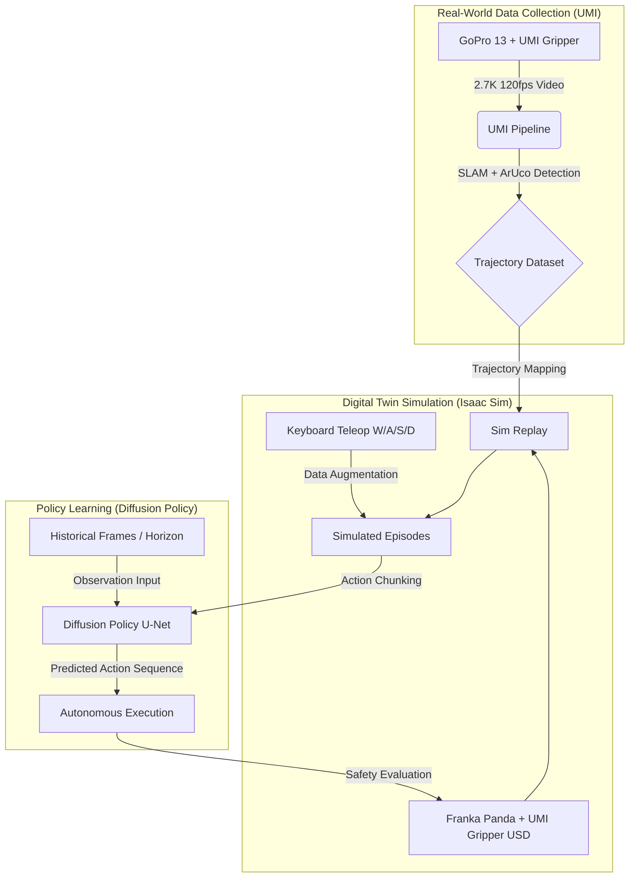

# Robot-Imitation-Learning-Workshop
### From Teleoperation to Autonomous Policy: A Practical Imitation Learning Pipeline

> A hands-on implementation framework built across two intensive programs:
> ITRI collaborative robot data collection (Jan 19–23, 2026) and the NYCU Physical AI Workshop on UMI × Isaac Sim (Feb 11–12, 2026).

Reference environment: [HCIS-Lab / physical-ai-umi](https://github.com/HCIS-Lab/physical-ai-umi/tree/dev)

---


---

## Overview


| Program | Date | Focus |
|---------|------|-------|
| **ITRI Visit** | Jan 19–23, 2026 | Physical robot data collection with Techman (TM5) collaborative arm |
| **NYCU Workshop** | Feb 11–12, 2026 | UMI × Isaac Sim full pipeline: teleoperation → data processing → policy training |

---

## Repository Structure

| Directory | Contents |
|-----------|---------|
| `configs/` | Training hyperparameters and model architecture settings (`.yaml`) |
| `data/` | Robot trajectory data format definitions (JSON / HDF5) |
| `scripts/` | Teleoperation interface, data preprocessing, and Diffusion Policy training pipeline |
| `description/` | Technical notes and reflection documents |

---

## Part 1 — ITRI: Physical Robot Data Collection

### Hardware

**Techman TM5** collaborative robot arm with wrist-mounted vision sensor.

### Task

Pick-and-place of transparent objects — one of the most challenging scenarios for vision-based manipulation due to specular reflection and depth ambiguity.

<p align="center">
  
  <br/>
  <i>Techman TM5 data collection for transparent object grasping at ITRI</i>
</p>

### Key Practices

- Recorded expert demonstration trajectories for downstream imitation learning
- Handled coordinate synchronization between the vision sensor and end-effector gripper frame
- Applied consistent approach trajectories to ensure demonstration quality for policy training

### Demo

https://github.com/user-attachments/assets/4690878b-054e-4f42-8d15-6633e2d1879b

---

## Part 2 — NYCU Workshop: UMI × Isaac Sim Full Pipeline

### System Architecture



### Data Collection Standards

**Camera setup:** GoPro 13 at 2.7K 120fps, 4:3 fisheye, bird's-eye view (BEV) angle.

**Calibration:** ArUco tags must be fully visible in the initial frames; Tag #13 covered with black cloth after calibration to prevent inference-time interference.

**Demonstration quality:** Objects placed at lens center; motion must be smooth and consistent across episodes — abrupt stops or jitter degrade Diffusion Policy training due to its temporal conditioning on historical frames.

### Demo

https://github.com/user-attachments/assets/12332e5b-3822-4dbc-8a3d-d747a40e87df

https://github.com/user-attachments/assets/96dbcf79-f9cf-4fc2-a633-fb94559309fb

https://github.com/user-attachments/assets/a494ec30-5ae8-48f1-9711-12e8d1b825fb

https://github.com/user-attachments/assets/74aa47d2-6628-44e2-984e-266b650fd6c2

### UMI Data Pipeline

```
Raw GoPro video
  → IMU extraction
  → SLAM map construction
  → ArUco tag detection
  → Object pose estimation
  → Trajectory dataset (.hdf5)
  → dataset_visualizer.ipynb (quality check)
  → Diffusion Policy training
```

---

## Technical Reflections

### 1. Temporal Coherence in Diffusion Policy

Unlike single-frame Behavior Cloning, Diffusion Policy conditions on a **sliding window of historical observations** and predicts a future **action chunk** rather than a single action. This has direct implications for data collection:

- Demonstration smoothness matters more than point accuracy — the model learns the *distribution* of motion, not just endpoint positions
- Approach trajectories (deceleration phase before grasp) must be logically consistent across episodes so the model can learn the transition from high-speed approach to precise manipulation
- Jitter or unnatural pauses in demonstrations corrupt the temporal signal the model relies on during denoising at inference time

### 2. Hierarchical Strategy for Home Service Robots

End-to-end learning of full trajectories is not always the most efficient approach. A hybrid framework better suits assistive robot applications:

| Stage | Method | Rationale |
|-------|--------|-----------|
| Navigation / approach | Motion planning (MoveIt / Nav2) | Well-solved problem; no training data needed |
| Fine manipulation | Imitation Learning / RL | High data efficiency for the hardest sub-task only |

This separation reduces total data requirements and improves generalization to novel environments.

### 3. Evaluation Metrics Beyond Success Rate

For assistive robotics targeting elderly users, success rate alone is insufficient:

- **Safety:** Monitor end-effector force and acceleration throughout execution, not only at contact
- **Trajectory smoothness:** Erratic motion causes hardware wear and reduces user trust
- **Failure mode analysis:** Classify error sources (data quality, environment variation, model uncertainty) to build more robust automated evaluation pipelines

---

## Quick Start

```bash
# Install dependencies
pip install -r scripts/requirements.txt

# Preprocess UMI demonstration data
python scripts/preprocess_umi.py --input data/raw/ --output data/processed/

# Train Diffusion Policy
python scripts/train.py --config configs/diffusion_policy.yaml

# Evaluate trained policy
python scripts/evaluate.py --checkpoint checkpoints/latest.ckpt
```

---

## Tech Stack

| Layer | Technology |
|-------|-----------|
| Physical robot | Techman TM5 (ITRI), Franka Panda (NYCU) |
| Data collection | UMI Gripper, GoPro 13 (2.7K 120fps) |
| Simulation | NVIDIA Isaac Sim, USD scene format |
| Policy learning | Diffusion Policy (U-Net backbone) |
| Data pipeline | UMI Pipeline, SLAM, ArUco pose estimation |
| Framework | Python 3.10, ROS2 Humble |

---

## Author

**Hui-Hsin Huang**
M.S. Candidate, Computer Science — National Cheng Kung University
Email: wenny2377@gmail.com
